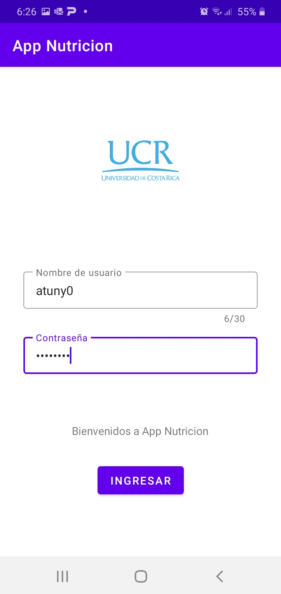
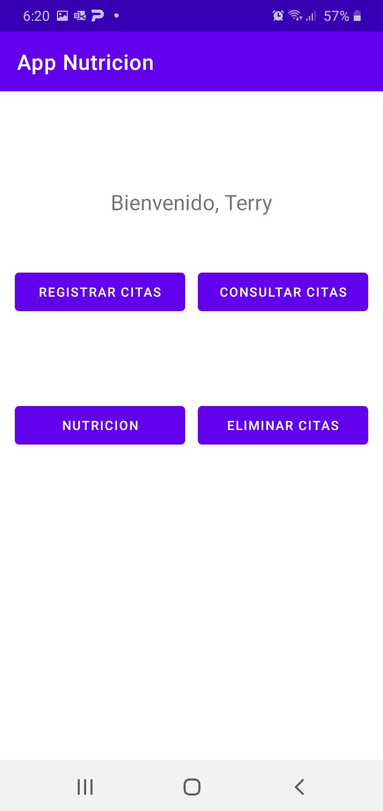
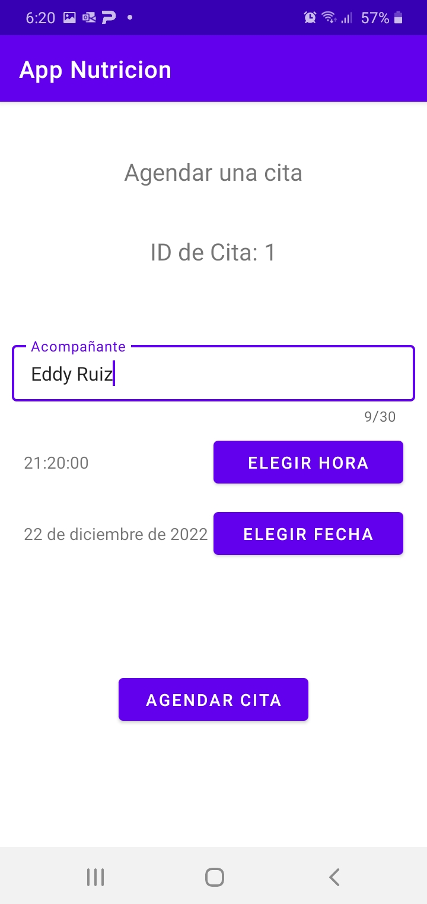
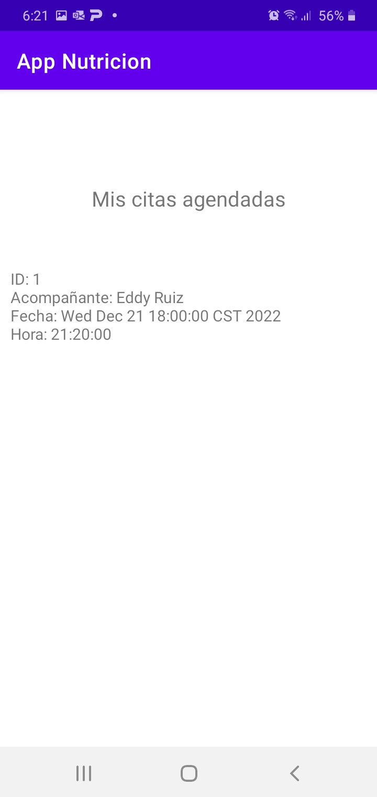

# Nutrition-App
Esta pequeña app es el resultado de realizar el Examen 1 del curso Desarrollo de aplicaciones móviles en el segundo semestre de 2022 en la Universidad de Costa Rica.

En esta app, se pone en uso:
- Ciclo de vida de las actividades.
- Consumo de API por medio de Volley y Gson, de Google.
- Recycler view.
- Clases que implementan Parcelable.
- Intents implícitos y explícitos.
- Fragments.
- Elementos especiales de input de usuario como Date picker y Time picker.

## Screenshots
|

